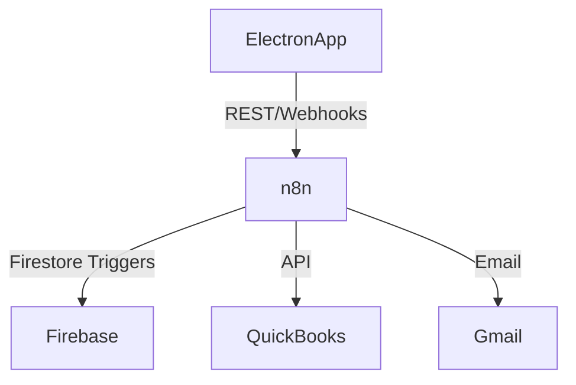

# Platform Integration Plan

This document describes how **Personal Finance Receipt Sorter** can be embedded into common workflows and external platforms such as Google Docs, Gmail, and accounting suites.

## Target Platforms
1. **Google Workspace**  
2. **Microsoft 365**  
3. **Email Clients (Gmail/Outlook)**  
4. **Accounting Software (QuickBooks, Xero)**

## Integration Architecture

## Embedding Scenarios
| Scenario | Method | Details |
|----------|--------|---------|
| Push processed receipts to Google Sheets | n8n HTTP Request → Sheets API | Adds a new row per receipt |
| Slack notification on failed OCR | Firestore Cloud Function → Slack Webhook | Sends alert with receipt ID |
| Inline suggestions in Google Docs | Google Add-on calling `/suggest-budget` endpoint | Uses doc sidebar panel |

## Security Considerations
- OAuth scopes limited to read/write receipts only.  
- All webhooks validated via HMAC.

## Roadmap
- [ ] Publish public Zapier integration  
- [ ] Native QuickBooks app listing  
- [ ] Gmail Smart-Compose finance add-on

---
*Last updated: <!-- YYYY-MM-DD -->* 