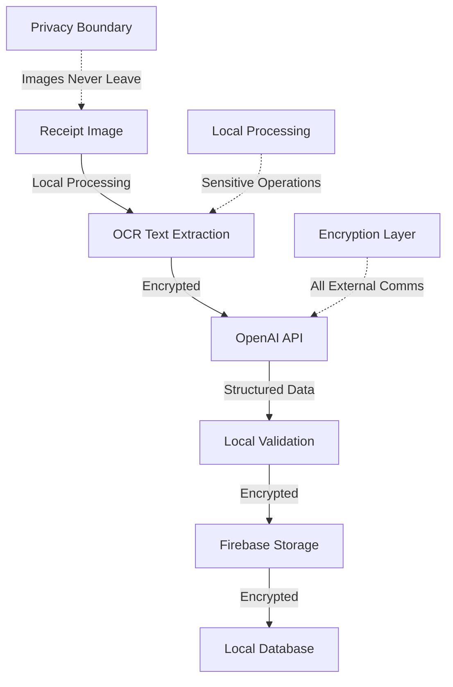

# Security Documentation

## Overview

The Personal Finance Receipt Sorter handles sensitive financial data and requires robust security measures to protect user privacy and prevent data breaches. This document outlines our comprehensive security strategy, implementation details, and best practices.

## Security Principles

### Core Security Principles

1. **Privacy by Design** - User data remains local whenever possible
2. **Data Minimization** - Only necessary data is processed and stored
3. **Encryption at Rest and in Transit** - All sensitive data is encrypted
4. **Zero Trust Architecture** - Verify every access request
5. **Least Privilege Access** - Minimal permissions for all operations
6. **Defense in Depth** - Multiple layers of security controls

### Compliance Standards

- **PCI DSS Level 1** - Payment card data protection
- **GDPR** - European data protection regulation
- **CCPA** - California consumer privacy act
- **SOC 2 Type II** - Security and availability controls

## Threat Model

### Assets to Protect

1. **Financial Data**
   - Receipt images and PDFs
   - Extracted transaction data
   - Spending patterns and analytics
   - Payment method information

2. **Personal Information**
   - User preferences and settings
   - File system paths
   - Usage analytics (optional)

3. **API Keys and Credentials**
   - OpenAI API keys
   - Firebase authentication tokens
   - Encryption keys

4. **Application Code**
   - Proprietary algorithms
   - Configuration data
   - Source code integrity

### Threat Actors

1. **External Attackers**
   - Remote code execution attempts
   - Data exfiltration attacks
   - Man-in-the-middle attacks
   - Social engineering

2. **Malicious Insiders**
   - Unauthorized data access
   - Data theft or misuse
   - System sabotage

3. **Accidental Threats**
   - User error leading to data exposure
   - Misconfiguration vulnerabilities
   - Software bugs and vulnerabilities

### Attack Vectors

1. **Network-based Attacks**
   - API endpoint exploitation
   - SSL/TLS vulnerabilities
   - DNS poisoning
   - Network eavesdropping

2. **Local System Attacks**
   - File system access exploitation
   - Process injection attacks
   - Registry manipulation (Windows)
   - Privilege escalation

3. **Application-level Attacks**
   - Code injection vulnerabilities
   - Deserialization attacks
   - Buffer overflow exploits
   - Logic flaws

## Data Protection Strategy

### Data Classification

| Classification | Examples | Protection Level |
|----------------|----------|------------------|
| **Highly Sensitive** | Payment card data, Tax IDs | Encryption + Access controls + Audit logging |
| **Sensitive** | Receipt amounts, Vendor names | Encryption + Access controls |
| **Internal** | User preferences, App settings | Access controls + Integrity checks |
| **Public** | App version, Feature flags | Integrity checks |

### Data Flow Security



### Encryption Strategy

#### Data at Rest

```typescript
// src/security/encryption.ts
import * as crypto from 'crypto';
import { app } from 'electron';
import * as keytar from 'keytar';

export class EncryptionService {
  private readonly algorithm = 'aes-256-gcm';
  private readonly keyLength = 32;
  private readonly ivLength = 16;
  private readonly tagLength = 16;

  async getOrCreateMasterKey(): Promise<Buffer> {
    const serviceName = 'receipt-sorter';
    const accountName = 'master-key';
    
    let keyString = await keytar.getPassword(serviceName, accountName);
    
    if (!keyString) {
      const masterKey = crypto.randomBytes(this.keyLength);
      keyString = masterKey.toString('base64');
      await keytar.setPassword(serviceName, accountName, keyString);
    }
    
    return Buffer.from(keyString, 'base64');
  }

  async encrypt(plaintext: string): Promise<EncryptedData> {
    const masterKey = await this.getOrCreateMasterKey();
    const iv = crypto.randomBytes(this.ivLength);
    
    const cipher = crypto.createCipher(this.algorithm, masterKey, { iv });
    
    let ciphertext = cipher.update(plaintext, 'utf8', 'hex');
    ciphertext += cipher.final('hex');
    
    const tag = cipher.getAuthTag();
    
    return {
      ciphertext,
      iv: iv.toString('hex'),
      tag: tag.toString('hex')
    };
  }

  async decrypt(encryptedData: EncryptedData): Promise<string> {
    const masterKey = await this.getOrCreateMasterKey();
    const iv = Buffer.from(encryptedData.iv, 'hex');
    const tag = Buffer.from(encryptedData.tag, 'hex');
    
    const decipher = crypto.createDecipher(this.algorithm, masterKey, { iv });
    decipher.setAuthTag(tag);
    
    let plaintext = decipher.update(encryptedData.ciphertext, 'hex', 'utf8');
    plaintext += decipher.final('utf8');
    
    return plaintext;
  }
}

interface EncryptedData {
  ciphertext: string;
  iv: string;
  tag: string;
}
```

#### Data in Transit

```typescript
// src/security/httpsClient.ts
import * as https from 'https';
import * as tls from 'tls';

export class SecureHttpsClient {
  private readonly httpsAgent: https.Agent;

  constructor() {
    this.httpsAgent = new https.Agent({
      // Enforce TLS 1.2 minimum
      secureProtocol: 'TLSv1_2_method',
      // Certificate pinning for critical services
      checkServerIdentity: this.checkServerIdentity,
      // Disable insecure ciphers
      ciphers: [
        'ECDHE-RSA-AES128-GCM-SHA256',
        'ECDHE-RSA-AES256-GCM-SHA384',
        'ECDHE-RSA-AES128-SHA256',
        'ECDHE-RSA-AES256-SHA384'
      ].join(':')
    });
  }

  private checkServerIdentity(hostname: string, cert: any): Error | undefined {
    // Implement certificate pinning for OpenAI and Firebase
    const pinnedCerts = {
      'api.openai.com': ['sha256/expected-cert-hash'],
      'firestore.googleapis.com': ['sha256/expected-cert-hash']
    };

    if (pinnedCerts[hostname]) {
      const certHash = crypto.createHash('sha256')
        .update(cert.raw)
        .digest('base64');
      
      if (!pinnedCerts[hostname].includes(`sha256/${certHash}`)) {
        return new Error('Certificate pinning validation failed');
      }
    }

    return tls.checkServerIdentity(hostname, cert);
  }
}
```

## Authentication & Authorization

### API Key Management

```typescript
// src/security/apiKeyManager.ts
import * as keytar from 'keytar';
import { EncryptionService } from './encryption';

export class APIKeyManager {
  private readonly encryptionService = new EncryptionService();
  private readonly serviceName = 'receipt-sorter-api-keys';

  async storeAPIKey(service: string, apiKey: string): Promise<void> {
    // Encrypt API key before storing
    const encryptedKey = await this.encryptionService.encrypt(apiKey);
    const encryptedKeyString = JSON.stringify(encryptedKey);
    
    await keytar.setPassword(this.serviceName, service, encryptedKeyString);
  }

  async getAPIKey(service: string): Promise<string | null> {
    const encryptedKeyString = await keytar.getPassword(this.serviceName, service);
    
    if (!encryptedKeyString) {
      return null;
    }

    try {
      const encryptedKey = JSON.parse(encryptedKeyString);
      return await this.encryptionService.decrypt(encryptedKey);
    } catch (error) {
      console.error('Failed to decrypt API key:', error);
      return null;
    }
  }

  async deleteAPIKey(service: string): Promise<boolean> {
    return await keytar.deletePassword(this.serviceName, service);
  }

  async rotateAPIKey(service: string, newApiKey: string): Promise<void> {
    // Store new key
    await this.storeAPIKey(service, newApiKey);
    
    // Log key rotation event
    this.auditLogger.logEvent('api_key_rotated', {
      service,
      timestamp: new Date().toISOString(),
      userId: this.getCurrentUserId()
    });
  }
}
```

### Firebase Security Rules

```javascript
// firestore.rules
rules_version = '2';
service cloud.firestore {
  match /databases/{database}/documents {
    // Users can only access their own data
    match /receipts/{receiptId} {
      allow read, write: if request.auth != null 
        && request.auth.uid == resource.data.userId
        && isValidReceiptData(request.resource.data);
    }
    
    match /categories/{categoryId} {
      allow read, write: if request.auth != null 
        && request.auth.uid == resource.data.userId;
    }
    
    match /settings/{userId} {
      allow read, write: if request.auth != null 
        && request.auth.uid == userId
        && isValidSettingsData(request.resource.data);
    }
    
    // Validation functions
    function isValidReceiptData(data) {
      return data.keys().hasAll(['vendor', 'date', 'total', 'category'])
        && data.total is number
        && data.total >= 0
        && data.total <= 10000 // Reasonable maximum
        && data.date is timestamp
        && data.vendor is string
        && data.vendor.size() <= 100;
    }
    
    function isValidSettingsData(data) {
      return data.keys().hasAll(['theme', 'notifications'])
        && data.theme in ['light', 'dark', 'system']
        && data.notifications is bool;
    }
  }
}
```

## Privacy Protection

### Local Data Processing

```typescript
// src/privacy/localProcessor.ts
export class LocalPrivacyProcessor {
  private readonly allowedDataTypes = [
    'image/jpeg',
    'image/png', 
    'application/pdf'
  ];

  async processReceiptLocally(filePath: string): Promise<ProcessingResult> {
    // Verify file type
    if (!this.isAllowedFileType(filePath)) {
      throw new Error('Unsupported file type');
    }

    // Extract text locally using Tesseract
    const ocrText = await this.extractTextLocally(filePath);
    
    // Sanitize OCR text before sending to AI
    const sanitizedText = this.sanitizeText(ocrText);
    
    // Only send sanitized text to OpenAI, never the original image
    const parsedData = await this.parseWithAI(sanitizedText);
    
    return {
      originalFile: filePath,
      extractedText: ocrText, // Kept locally
      sanitizedText, // Sent to AI
      parsedData
    };
  }

  private sanitizeText(text: string): string {
    // Remove potential PII patterns
    return text
      .replace(/\b\d{4}[\s-]?\d{4}[\s-]?\d{4}[\s-]?\d{4}\b/g, '[CARD]') // Credit card numbers
      .replace(/\b\d{3}-\d{2}-\d{4}\b/g, '[SSN]') // SSN patterns
      .replace(/\b[A-Za-z0-9._%+-]+@[A-Za-z0-9.-]+\.[A-Z|a-z]{2,}\b/g, '[EMAIL]'); // Email addresses
  }
}
```

### Data Retention Policy

```typescript
// src/privacy/dataRetention.ts
export class DataRetentionManager {
  private readonly defaultRetentionDays = 365 * 2; // 2 years
  
  async enforceRetentionPolicy(): Promise<void> {
    const cutoffDate = new Date();
    cutoffDate.setDate(cutoffDate.getDate() - this.defaultRetentionDays);
    
    // Get user's retention preference
    const userSettings = await this.getUserSettings();
    const retentionDays = userSettings.dataRetentionDays || this.defaultRetentionDays;
    
    // Find expired receipts
    const expiredReceipts = await this.getExpiredReceipts(retentionDays);
    
    for (const receipt of expiredReceipts) {
      await this.securelyDeleteReceipt(receipt);
    }
    
    // Log retention enforcement
    this.auditLogger.logEvent('data_retention_enforced', {
      deletedCount: expiredReceipts.length,
      retentionDays,
      timestamp: new Date().toISOString()
    });
  }

  private async securelyDeleteReceipt(receipt: Receipt): Promise<void> {
    // Secure deletion with multiple overwrites
    if (receipt.originalFilePath && fs.existsSync(receipt.originalFilePath)) {
      await this.secureFileDelete(receipt.originalFilePath);
    }
    
    // Remove from database
    await this.firestoreService.deleteReceipt(receipt.id);
    
    // Clear from local cache
    await this.clearFromCache(receipt.id);
  }

  private async secureFileDelete(filePath: string): Promise<void> {
    const fileSize = fs.statSync(filePath).size;
    const fd = fs.openSync(filePath, 'r+');
    
    try {
      // Overwrite with random data 3 times
      for (let i = 0; i < 3; i++) {
        const randomData = crypto.randomBytes(fileSize);
        fs.writeSync(fd, randomData, 0, fileSize, 0);
        fs.fsyncSync(fd);
      }
    } finally {
      fs.closeSync(fd);
      fs.unlinkSync(filePath);
    }
  }
}
```

## Secure Development Practices

### Input Validation

```typescript
// src/security/inputValidator.ts
import * as Joi from 'joi';

export class InputValidator {
  private readonly receiptSchema = Joi.object({
    vendor: Joi.string().max(100).required(),
    date: Joi.date().iso().required(),
    total: Joi.number().positive().max(10000).required(),
    tax: Joi.number().min(0).max(1000).optional(),
    currency: Joi.string().length(3).uppercase().default('USD'),
    category: Joi.string().valid(...this.validCategories).required(),
    items: Joi.array().items(Joi.object({
      name: Joi.string().max(200).required(),
      price: Joi.number().positive().max(1000).required(),
      quantity: Joi.number().integer().positive().max(100).default(1)
    })).optional()
  });

  validateReceipt(data: any): Receipt {
    const { error, value } = this.receiptSchema.validate(data);
    
    if (error) {
      throw new ValidationError(`Invalid receipt data: ${error.message}`);
    }
    
    return value;
  }

  sanitizeFilePath(filePath: string): string {
    // Prevent path traversal attacks
    const normalizedPath = path.normalize(filePath);
    
    if (normalizedPath.includes('..') || normalizedPath.startsWith('/')) {
      throw new SecurityError('Invalid file path detected');
    }
    
    return normalizedPath;
  }

  validateFileType(filePath: string): boolean {
    const allowedExtensions = ['.jpg', '.jpeg', '.png', '.pdf'];
    const extension = path.extname(filePath).toLowerCase();
    
    return allowedExtensions.includes(extension);
  }
}
```

### Secure Error Handling

```typescript
// src/security/errorHandler.ts
export class SecureErrorHandler {
  handleError(error: Error, context?: any): void {
    // Log full error details internally
    this.logger.error('Application error', {
      message: error.message,
      stack: error.stack,
      context,
      timestamp: new Date().toISOString()
    });

    // Return sanitized error to user
    const userError = this.sanitizeError(error);
    this.notifyUser(userError);
  }

  private sanitizeError(error: Error): UserError {
    // Never expose internal paths, API keys, or sensitive data
    const sanitizedMessage = error.message
      .replace(/\/[^\/\s]+\/[^\/\s]+/g, '[PATH]') // Remove file paths
      .replace(/[a-zA-Z0-9]{32,}/g, '[KEY]'); // Remove potential API keys

    return {
      type: 'ProcessingError',
      message: sanitizedMessage,
      code: this.getErrorCode(error),
      timestamp: new Date().toISOString()
    };
  }

  private getErrorCode(error: Error): string {
    if (error instanceof ValidationError) return 'VALIDATION_ERROR';
    if (error instanceof NetworkError) return 'NETWORK_ERROR';
    if (error instanceof SecurityError) return 'SECURITY_ERROR';
    return 'UNKNOWN_ERROR';
  }
}
```

### Code Security Scanning

```yaml
# .github/workflows/security.yml
name: Security Scan

on:
  push:
    branches: [main, develop]
  pull_request:
    branches: [main]

jobs:
  security-scan:
    runs-on: ubuntu-latest
    steps:
      - uses: actions/checkout@v3
      
      - name: Run Snyk Security Scan
        uses: snyk/actions/node@master
        env:
          SNYK_TOKEN: ${{ secrets.SNYK_TOKEN }}
        with:
          args: --severity-threshold=medium
      
      - name: Run CodeQL Analysis
        uses: github/codeql-action/init@v2
        with:
          languages: typescript, javascript
      
      - name: Perform CodeQL Analysis
        uses: github/codeql-action/analyze@v2
      
      - name: Run OWASP Dependency Check
        uses: dependency-check/Dependency-Check_Action@main
        with:
          project: 'receipt-sorter'
          path: '.'
          format: 'JSON'
      
      - name: Upload Security Results
        uses: actions/upload-artifact@v3
        with:
          name: security-results
          path: reports/
```

## Incident Response

### Security Monitoring

```typescript
// src/security/securityMonitor.ts
export class SecurityMonitor {
  private readonly suspiciousPatterns = [
    /\.\.\//g, // Path traversal
    /<script/gi, // XSS attempts
    /union\s+select/gi, // SQL injection
    /eval\s*\(/gi, // Code injection
  ];

  monitorFileAccess(filePath: string, operation: string): void {
    // Check for suspicious file access patterns
    if (this.isSuspiciousFileAccess(filePath, operation)) {
      this.triggerSecurityAlert('suspicious_file_access', {
        filePath: this.sanitizePath(filePath),
        operation,
        timestamp: new Date().toISOString(),
        processId: process.pid
      });
    }
  }

  monitorAPIUsage(endpoint: string, payload: any): void {
    // Monitor for unusual API usage patterns
    const payloadString = JSON.stringify(payload);
    
    for (const pattern of this.suspiciousPatterns) {
      if (pattern.test(payloadString)) {
        this.triggerSecurityAlert('suspicious_api_usage', {
          endpoint,
          pattern: pattern.toString(),
          timestamp: new Date().toISOString()
        });
        break;
      }
    }
  }

  private triggerSecurityAlert(alertType: string, details: any): void {
    // Log security incident
    this.securityLogger.warn('Security alert triggered', {
      alertType,
      details,
      severity: 'high'
    });

    // Notify security team (in production)
    if (process.env.NODE_ENV === 'production') {
      this.notifySecurityTeam(alertType, details);
    }
  }
}
```

### Incident Response Plan

1. **Detection Phase**
   - Automated monitoring alerts
   - User-reported security issues
   - Third-party security notifications

2. **Analysis Phase**
   - Assess incident severity
   - Determine scope of impact
   - Identify affected systems/data

3. **Containment Phase**
   - Isolate affected systems
   - Prevent further damage
   - Preserve evidence

4. **Eradication Phase**
   - Remove threat from environment
   - Patch vulnerabilities
   - Update security controls

5. **Recovery Phase**
   - Restore normal operations
   - Monitor for recurring issues
   - Validate system integrity

6. **Lessons Learned**
   - Document incident details
   - Update security procedures
   - Improve detection capabilities

## Security Testing

### Penetration Testing Checklist

- [ ] Network security assessment
- [ ] Application vulnerability scanning
- [ ] Social engineering testing
- [ ] Physical security review
- [ ] Wireless security assessment
- [ ] Database security testing
- [ ] API security validation
- [ ] Authentication bypass testing
- [ ] Authorization flaw detection
- [ ] Input validation testing

### Security Test Automation

```typescript
// tests/security/securityTests.test.ts
describe('Security Tests', () => {
  describe('Input Validation', () => {
    it('should reject malicious file paths', () => {
      const maliciousPaths = [
        '../../../etc/passwd',
        '..\\..\\windows\\system32',
        '/etc/shadow',
        'C:\\Windows\\System32\\config\\SAM'
      ];

      maliciousPaths.forEach(path => {
        expect(() => inputValidator.sanitizeFilePath(path))
          .toThrow('Invalid file path detected');
      });
    });

    it('should sanitize OCR text properly', () => {
      const textWithPII = 'Card: 4532-1234-5678-9012 SSN: 123-45-6789';
      const sanitized = privacyProcessor.sanitizeText(textWithPII);
      
      expect(sanitized).not.toContain('4532-1234-5678-9012');
      expect(sanitized).not.toContain('123-45-6789');
      expect(sanitized).toContain('[CARD]');
      expect(sanitized).toContain('[SSN]');
    });
  });

  describe('Encryption', () => {
    it('should encrypt and decrypt data correctly', async () => {
      const plaintext = 'sensitive financial data';
      const encrypted = await encryptionService.encrypt(plaintext);
      const decrypted = await encryptionService.decrypt(encrypted);
      
      expect(decrypted).toBe(plaintext);
      expect(encrypted.ciphertext).not.toContain(plaintext);
    });

    it('should use different IVs for each encryption', async () => {
      const plaintext = 'test data';
      const encrypted1 = await encryptionService.encrypt(plaintext);
      const encrypted2 = await encryptionService.encrypt(plaintext);
      
      expect(encrypted1.iv).not.toBe(encrypted2.iv);
      expect(encrypted1.ciphertext).not.toBe(encrypted2.ciphertext);
    });
  });
});
```

## Compliance & Auditing

### Audit Logging

```typescript
// src/security/auditLogger.ts
export class AuditLogger {
  private readonly logFile: string;

  constructor() {
    this.logFile = path.join(app.getPath('userData'), 'audit.log');
  }

  logEvent(eventType: string, details: any): void {
    const auditEvent = {
      timestamp: new Date().toISOString(),
      eventType,
      userId: this.getCurrentUserId(),
      sessionId: this.getSessionId(),
      details: this.sanitizeDetails(details),
      integrity: this.calculateIntegrity(details)
    };

    this.writeAuditLog(auditEvent);
  }

  logDataAccess(resource: string, operation: string, success: boolean): void {
    this.logEvent('data_access', {
      resource,
      operation,
      success,
      userAgent: this.getUserAgent(),
      ipAddress: this.getClientIP()
    });
  }

  logSecurityEvent(eventType: string, severity: 'low' | 'medium' | 'high', details: any): void {
    this.logEvent('security_event', {
      securityEventType: eventType,
      severity,
      ...details
    });
  }

  private calculateIntegrity(data: any): string {
    return crypto.createHash('sha256')
      .update(JSON.stringify(data))
      .digest('hex');
  }

  private writeAuditLog(event: AuditEvent): void {
    const logEntry = JSON.stringify(event) + '\n';
    fs.appendFileSync(this.logFile, logEntry, { encoding: 'utf8' });
  }
}
```

### Compliance Reporting

```typescript
// src/compliance/complianceReporter.ts
export class ComplianceReporter {
  async generateGDPRReport(userId: string): Promise<GDPRReport> {
    const userData = await this.collectUserData(userId);
    
    return {
      personalData: {
        receipts: userData.receipts.map(r => ({
          id: r.id,
          vendor: r.vendor,
          date: r.date,
          amount: r.total
        })),
        settings: userData.settings,
        categories: userData.categories
      },
      dataProcessing: {
        purposes: ['Financial tracking', 'Expense categorization'],
        legalBasis: 'User consent',
        retention: '2 years or until user deletion request',
        sharing: 'Data is not shared with third parties'
      },
      userRights: {
        access: 'Available through export function',
        rectification: 'Available through edit functions',
        erasure: 'Available through delete account function',
        portability: 'Available through CSV export'
      }
    };
  }

  async handleDataDeletionRequest(userId: string): Promise<void> {
    // Comprehensive data deletion
    await this.deleteUserReceipts(userId);
    await this.deleteUserSettings(userId);
    await this.deleteUserCategories(userId);
    await this.deleteAuditLogs(userId);
    
    // Log deletion for compliance
    this.auditLogger.logEvent('gdpr_deletion_completed', {
      userId,
      deletionDate: new Date().toISOString(),
      dataTypes: ['receipts', 'settings', 'categories', 'audit_logs']
    });
  }
}
```

This comprehensive security documentation ensures the Personal Finance Receipt Sorter maintains the highest standards of data protection, privacy, and security throughout its operation. 