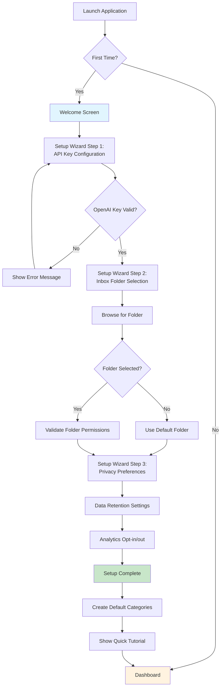
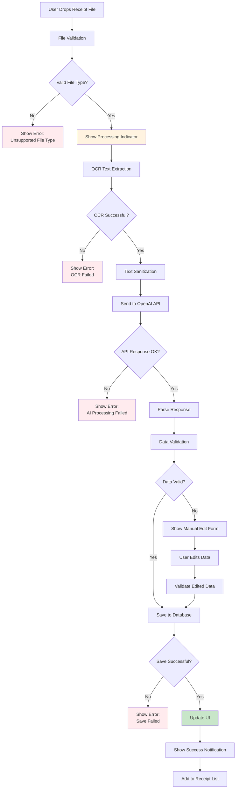
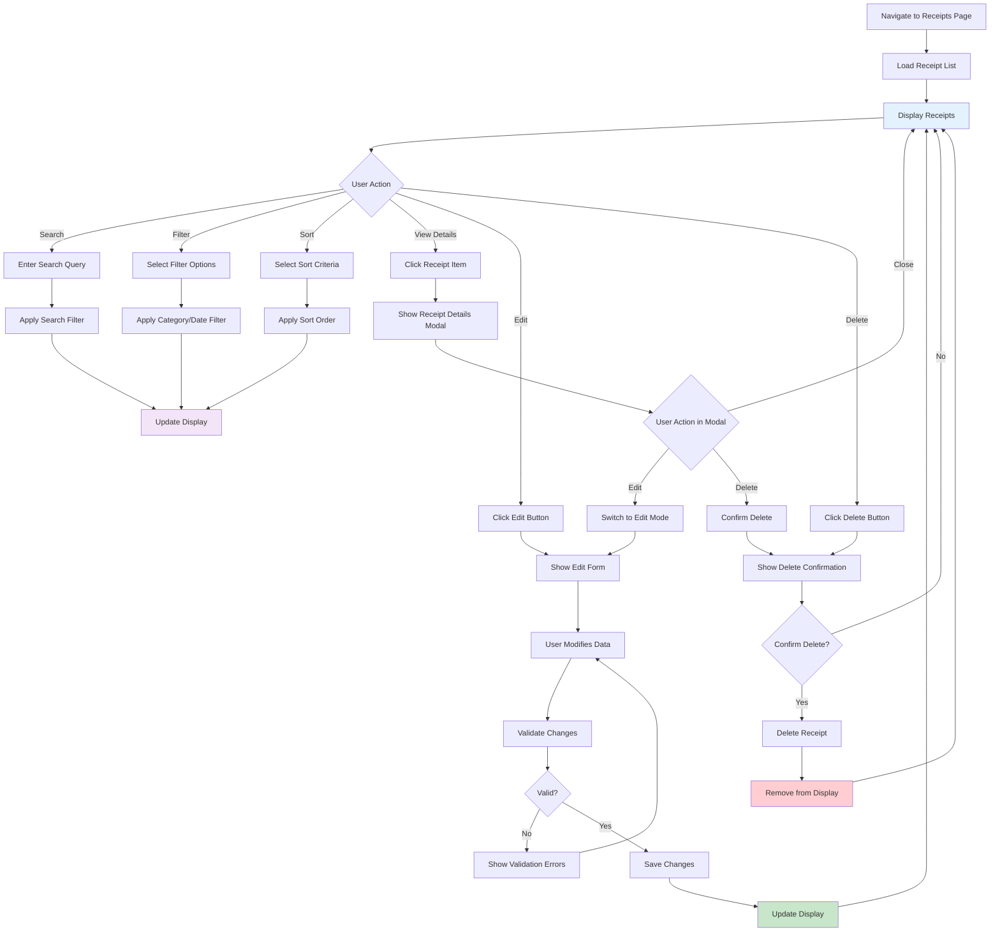
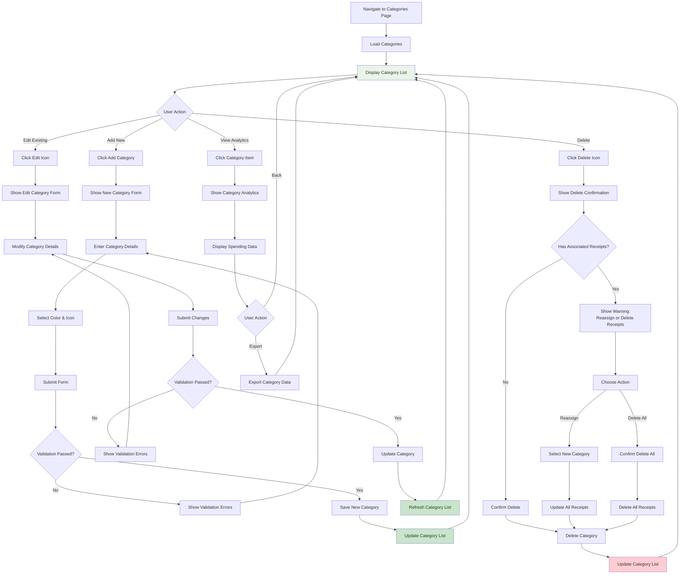
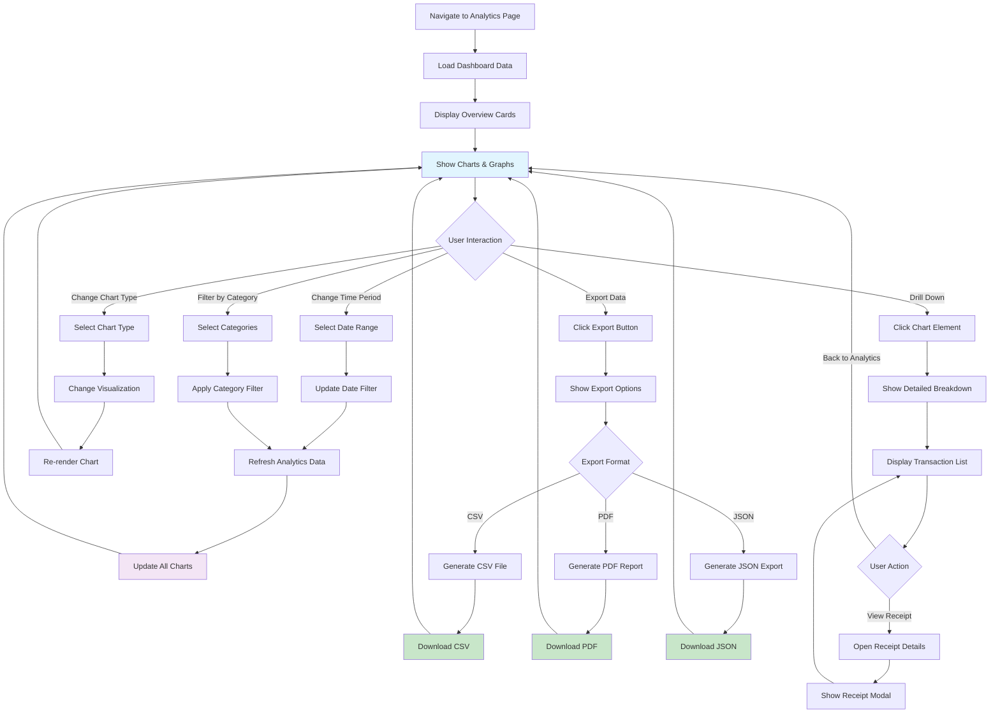
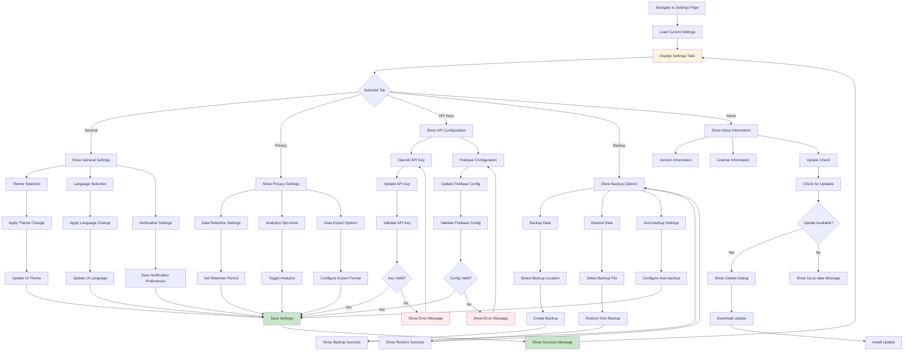
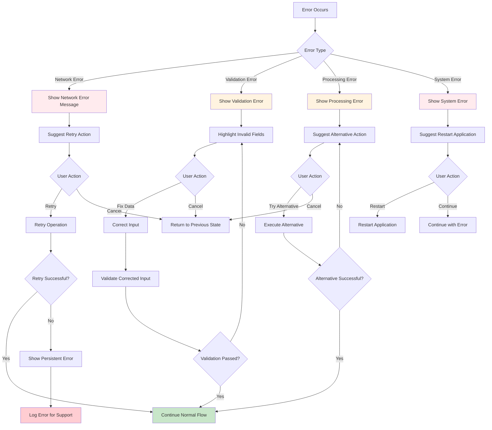
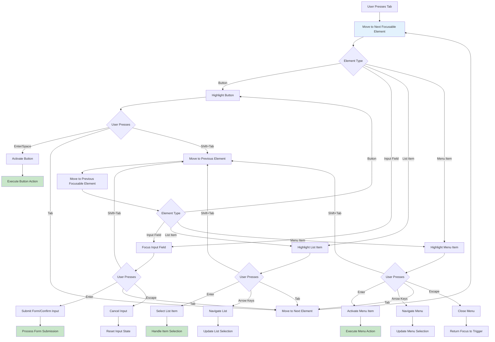
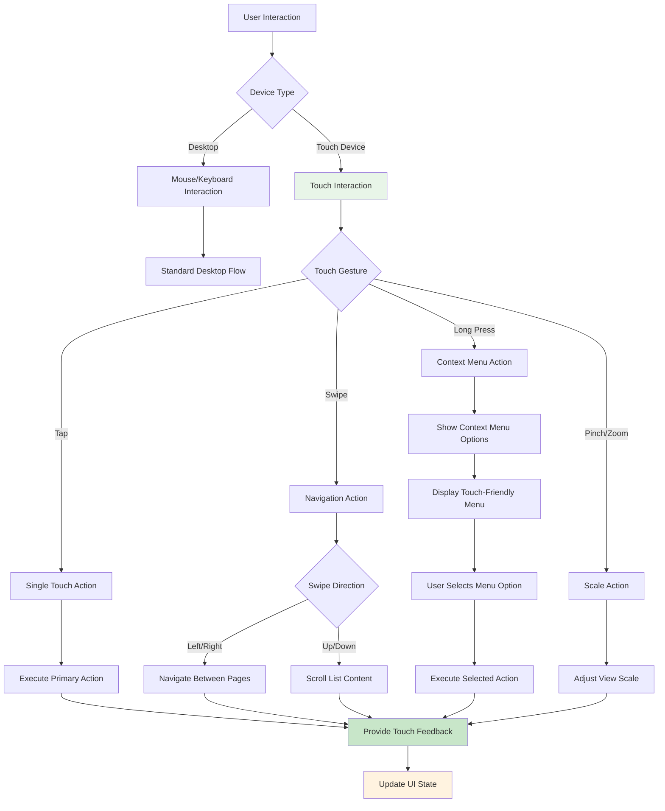

# User Flow Diagrams

## Overview

This document contains detailed user flow diagrams that illustrate how users interact with the Personal Finance Receipt Sorter application. These flows cover all major user journeys from initial setup to advanced features.

## Primary User Flows

### 1. First-Time User Setup Flow

### 2. Receipt Processing Flow

### 3. Receipt Management Flow

### 4. Category Management Flow

### 5. Analytics and Reporting Flow

### 6. Settings and Preferences Flow

## Secondary User Flows

### 7. Error Handling Flow

### 8. Keyboard Navigation Flow

## Mobile-Responsive Flow Considerations

### 9. Touch Interface Adaptations

These user flow diagrams provide comprehensive documentation of all user interactions within the Personal Finance Receipt Sorter application, ensuring clear understanding of user journeys and helping guide development and testing efforts. 